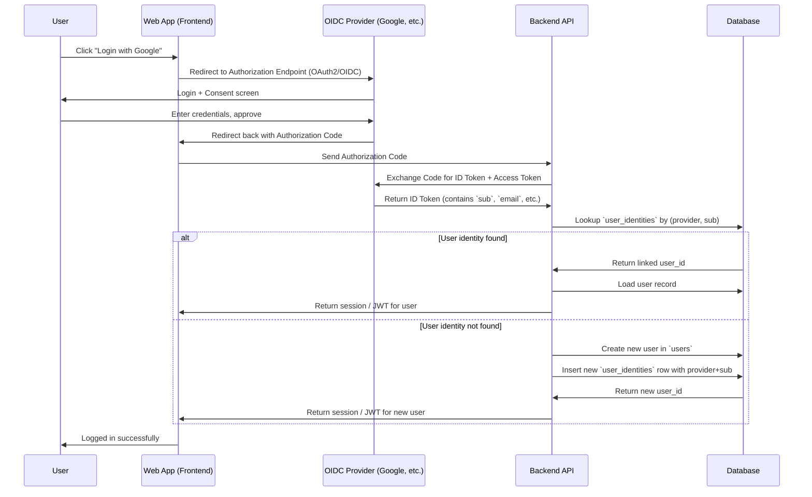

# My Home Digital Bookshelf Application – Full Specification

## 1. Overview

The **My Home Digital Bookshelf** is a **web-based application** designed to manage personal and family book collections.
It enables users to search, categorize, and track book ownership, reading progress, and lending activity.

The system supports **barcode scanning**, manual book entry, and automatic categorization using the **Japanese C-Code** classification standard.

---

## 2. Core Features

### 2.1 Book Search

* **Search registered books** by:
  * Title
  * Author
  * ISBN
  * Category
  * Reading Status
* Filters:
  * Category
  * C-Code
  * Owner
  * Reading Status
* Sorting:
  * Title
  * Author
  * Purchase Date
* **Search unregistered books** via the Google Books API by:
  * Partial keyword matching

### 2.2 Categorization

* Default classification via **Japanese C-Code** (Audience, Genre, Format)
* Support for **custom tags** and **custom categories**
* Automatic category assignment based on ISBN lookup
* Manual override of assigned categories

### 2.3 Book Registration

#### 2.3.1 Barcode Scanning

* ISBN scanning via device camera (mobile browsers; native app planned)
* Automatic metadata retrieval:
  * Title
  * Author
  * Publisher
  * Publication Date
  * C-Code

#### 2.3.2 Manual Entry

* Input fields:
  * ISBN
  * Title
  * Author
  * Publisher
  * Publish Date
  * Category
  * C-Code
  * Cover Image
  * Notes

### 2.4 Member Book Status Tracking

Per user, track:

* Ownership (Owned / Not Owned)
* Reading Status (Unread, Want to Read, Reading, Completed)
* Loan Status (None, Lent Out, Borrowed)
* Purchase Date and Price

### 2.5 Bookshelf Management

* Each user must belong to at least **one** bookshelf
* A bookshelf can have multiple members
* A book belongs to exactly **one** bookshelf

### 2.6 Additional Features

* **Recently Added / Recently Read** – Quick dashboard view showing the most recently registered or read books to encourage engagement.
* **Bulk Actions** – Select multiple books at once to:
  * Apply tags
  * Change reading status
  * Mark as owned or not owned
* **Bookshelf View Modes**:
  * Traditional list view
  * **Cover-based “bookshelf view”** for a visual browsing experience
* **OIDC Login**
  * Users can choose the following ID provider to login
    * Google
  * Users can also choose traditional username/password login

---

## 3. Platforms & Technology

### 3.1 Web Application (Primary Platform)

* Responsive design (desktop, tablet, mobile)
* Progressive Web App (PWA) features:
  * Home screen installation
  * Offline caching
  * Push notifications (e.g., loan reminders, new additions)

### 3.2 Mobile App (Future Roadmap)

* Native iOS and Android applications
* Shared backend with web app
* Enhanced barcode scanning performance
* Offline-first features

---

## 4. User Roles & Permissions

### 4.1 System Roles

| Role              | Capabilities                                                             |
| ----------------- | ------------------------------------------------------------------------ |
| **Administrator** | Full access to all bookshelves, members, categories, and system settings |
| **Member**        | Add/edit owned books, update statuses, search entire library             |
| **Guest**         | Search and view public book lists only                                   |

### 4.2 Bookshelf Roles

| Role              | Capabilities                                                                                 |
| ----------------- | -------------------------------------------------------------------------------------------- |
| **Administrator** | Manage members to access the bookshelf, full access to books and categories in the bookshelf |
| **Member**        | Add/edit owned books in the bookshelf, update statuses, search entire library                |

---

## 5. Data Model

### 5.1 Bookshelves Table

| Field       | Type     | Description          | Not NULL |
| ----------- | -------- | -------------------- | -------- |
| id          | UUID     | Primary key          | True     |
| name        | String   | Bookshelf name       | True     |
| description | Text     | Optional description | False    |
| created\_at | DateTime | Created timestamp    | True     |
| updated\_at | DateTime | Updated timestamp    | True     |

### 5.2 Categories Table

| Field         | Type     | Description                  | Not NULL |
| ------------- | -------- | ---------------------------- | -------- |
| id            | UUID     | Primary key                  | True     |
| name          | String   | Unique category name         | True     |
| description   | Text     | Optional description         | False    |
| bookshelf\_id | UUID     | Foreign key → Bookshelves.id | True     |
| created\_at   | DateTime | Created timestamp            | True     |
| updated\_at   | DateTime | Updated timestamp            | True     |

### 5.3 Books Table

| Field             | Type     | Description                  | Not NULL |
| ----------------- | -------- | ---------------------------- | -------- |
| id                | UUID     | Primary key                  | True     |
| title             | String   | Book title                   | True     |
| authors           | String   | Authors separated by `,`     | False    |
| isbn              | String   | ISBN-10 or ISBN-13           | False    |
| publisher         | String   | Publisher                    | False    |
| publish\_date     | Date     | Publish date                 | False    |
| c\_code           | String   | Japanese C-Code              | False    |
| category\_id      | UUID     | Foreign key → Categories.id  | False    |
| cover\_image\_url | String   | Cover image URL              | False    |
| notes             | Text     | Notes                        | False    |
| bookshelf\_id     | UUID     | Foreign key → Bookshelves.id | True     |
| created\_at       | DateTime | Created timestamp            | True     |
| updated\_at       | DateTime | Updated timestamp            | True     |

### 5.4 Users Table

| Field         | Type     | Description                             | Not NULL |
| ------------- | -------- | --------------------------------------- | -------- |
| id            | UUID     | Primary key                             | True     |
| username      | String   | Unique username                         | True     |
| email         | String   | Unique email                            | True     |
| password_hash | String   | Only required if user wants local login | False    |
| role          | Enum     | Admin/Member/Guest                      | True     |
| created\_at   | DateTime | Created timestamp                       | True     |

### 5.5 User Identities Table

| Field      | Type     | Description                          | Not NULL |
| ---------- | -------- | ------------------------------------ | -------- |
| id         | UUID     | Primary key                          | True     |
| user_id    | UUID     | FK to users(id)                      | True     |
| provider   | String   | 'google', 'microsoft', 'apple', etc. | True     |
| subject    | String   | OIDC 'sub' claim                     | True     |
| email      | String   | Email from provider (optional)       | False    |
| created_at | DateTime | Created timestamp                    | True     |

### 5.6 Sessions Table

| Field         | Type     | Description                             | Not NULL |
| ------------- | -------- | --------------------------------------- | -------- |
| id            | UUID     | Primary key (session ID)                | True     |
| user_id       | UUID     | FK → users.id                           | True     |
| token         | String   | JWT                                     | True     |
| created_at    | DateTime | When session was created                | True     |
| expires_at    | DateTime | When session should expire              | True     |
| ip_address    | String   | (Optional) Origin IP for security/audit | False    |
| user_agent    | String   | (Optional) Browser/device info          | False    |
| refresh_token | String   | (Optional) For long-lived refresh (JWT) | False    |

### 5.7 BookshelfUsers Table (Many-to-Many)

| Field         | Type     | Description                  | Not NULL |
| ------------- | -------- | ---------------------------- | -------- |
| user\_id      | UUID     | Foreign key → Users.id       | True     |
| bookshelf\_id | UUID     | Foreign key → Bookshelves.id | True     |
| role          | Enum     | Admin/Member/Guest           | True     |
| created\_at   | DateTime | Created timestamp            | True     |
| updated\_at   | DateTime | Updated timestamp            | True     |

### 5.8 UserBooks Table (Many-to-Many)

| Field           | Type    | Description                               | Not NULL |
| --------------- | ------- | ----------------------------------------- | -------- |
| user\_id        | UUID    | Foreign key → Users.id                    | True     |
| book\_id        | UUID    | Foreign key → Books.id                    | True     |
| ownership       | Bool    | Whether the user owns the book            | False    |
| reading\_status | Enum    | Unread / WantToRead / Reading / Completed | False    |
| loan\_status    | Enum    | None / Lent / Borrowed                    | False    |
| purchase\_date  | Date    | Purchase date                             | False    |
| price           | Decimal | Purchase price                            | False    |

---

## 6. User Interface Requirements

**Screens:**

1. **Library / Home** – Book list with search, filter, and sort
2. **Book Detail** – Metadata, member statuses, edit options
3. **Barcode Scan** – Camera-based ISBN input
4. **Manual Entry** – Direct book data entry form
5. **External Search** – Display and register results from Google Books API
6. **Category Management** – Add, edit, delete custom categories
7. **Member Status** – View/update per-member book statuses

---

## 7. Example Workflow

1. User selects **Add Book → Scan Barcode**
2. App scans ISBN and fetches book metadata including C-Code
3. User confirms or edits details, assigns categories/tags
4. Book is saved and marked as **Owned**

---

## Appendix A – Japanese C-Code Reference

### A.1 Audience (1st digit)

| Code | Meaning                      |
| ---- | ---------------------------- |
| 0    | General (一般)               |
| 1    | Cultural/Educational (教養)  |
| 2    | Practical (実用)             |
| 3    | Specialized (専門)           |
| 4    | Textbook/Exam (検定教科書等) |
| 5    | Women (婦人)                 |
| 6    | Study Aids I (小中学生)      |
| 7    | Study Aids II (高校生)       |
| 8    | Children (児童)              |
| 9    | Magazine Handling (雑誌扱い) |

### A.2 Format (2nd digit)

| Code | Meaning                  |
| ---- | ------------------------ |
| 0    | Hardcover / General      |
| 1    | Paperback                |
| 2    | New Book                 |
| 3    | Collected Works / Series |
| 4    | Mook / Calendar / Other  |
| 5    | Reference / Dictionary   |
| 6    | Illustrated              |
| 7    | Picture Book             |
| 8    | Magnetic Media           |
| 9    | Comics                   |

### A.3 Genre (last two digits)

Summary ranges:

* 00–04: Generalities, Encyclopedias, Magazines, Information Science
* 10–16: Philosophy, Psychology, Religion
* 20–26: History, Biography, Geography
* 30–39: Social Sciences, Law, Economics, Education, Folklore
* 40–47: Natural Sciences, Mathematics, Medicine
* 50–58: Engineering
* 60–65: Agriculture, Fisheries, Commerce, Transport
* 70–79: Arts, Sports, Entertainment
* 80–87: Languages
* 90–98: Literature (Japanese & Foreign)

### A.4 Example

* **C0193**: Audience `0` (General), Format `1` (Paperback), Genre `93` (Japanese Novels)
* **C2037**: Audience `2` (Practical), Format `0` (Hardcover), Genre `37` (Education)

---

## Appendix B – Official C-Code Resources

* [日本図書コードの分類コード（C-コード） — Official PDF](https://www.sasshi-insatsu.com/wp/wp-content/uploads/2023/01/ccode_ori.pdf)

## Appendix C - OpenID Connect Login Sequence

### 🔑 Key Points in Flow

1. **OIDC provider returns `sub`** → this is the unique ID you always trust.
2. **Database lookup** happens in `user_identities` by `(provider, sub)`.
3. If found → link to existing user.
4. If not found → create new user and link identity.
5. Result → your system issues a **local session or JWT** tied to your `users.id`.
